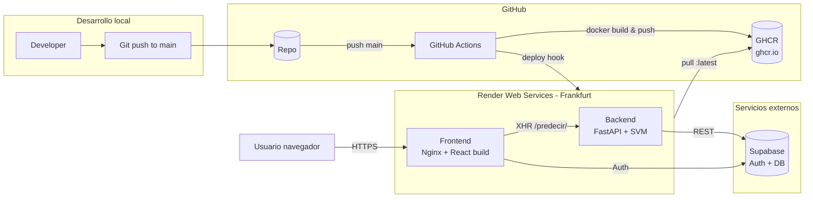
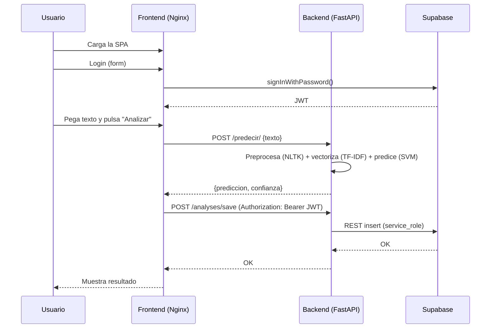

# Arquitectura — Alpha

## Visión general

## Componentes

| Componente | Tecnología                  | Imagen Docker base       | Observaciones |
|------------|-----------------------------|--------------------------|---------------|
| Backend    | FastAPI + scikit-learn SVM  | `python:3.11-slim`       | Carga modelos `.pkl` y NLTK al arranque (~25 s cold start). Multi-stage build. |
| Frontend   | React 19 + Vite + Tailwind  | `nginx:1.27-alpine`      | Variables `VITE_*` inlineadas en build-time. SPA fallback en Nginx. |
| Auth/DB    | Supabase (gestionado)       | n/a                      | Auth de usuarios + tabla `analyses`. |
| Modelos ML | SVM + TF-IDF (joblib)       | n/a                      | Empaquetados en la imagen del backend (~220 KB total). |

## Flujo de un análisis

## Decisiones de diseño relevantes

- **Modelos en la imagen**, no en almacenamiento externo: son < 1 MB y
  versionarlos junto al código simplifica reproducibilidad.
- **`VITE_*` build-time**: cualquier cambio de URL del backend obliga a
  regenerar la imagen del frontend (no es configurable en runtime).
- **Render plan Free**: cold start ~30 s tras 15 min inactivos. Aceptable
  para alpha; en producción migrar a plan Starter.
- **CORS `allow_origins=["*"]`**: aceptable en alpha, **endurecer** antes
  de la beta para apuntar al dominio del frontend.
- **GHCR como registro**: integración nativa con Actions, sin coste para
  repos públicos.
